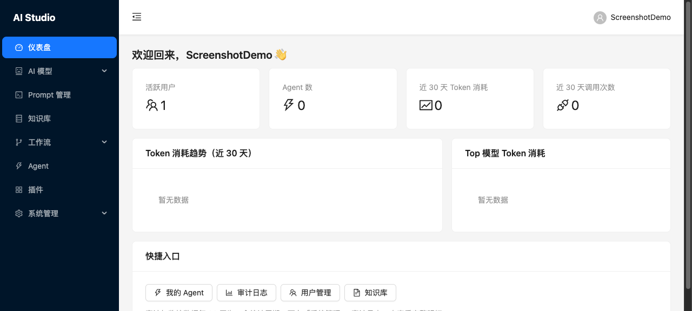
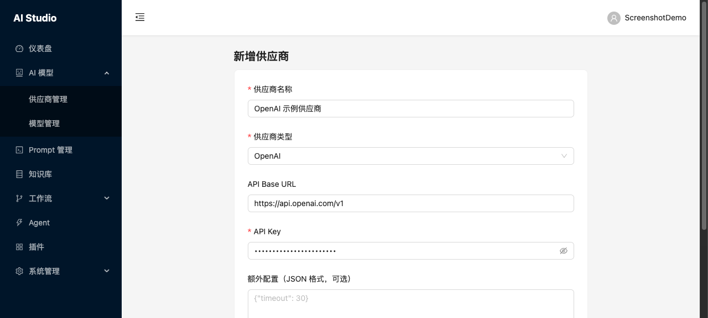
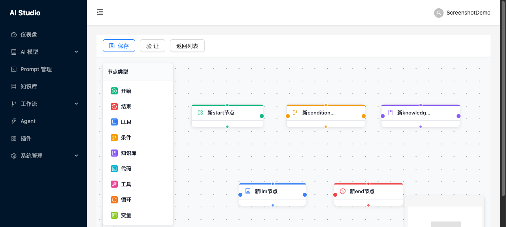
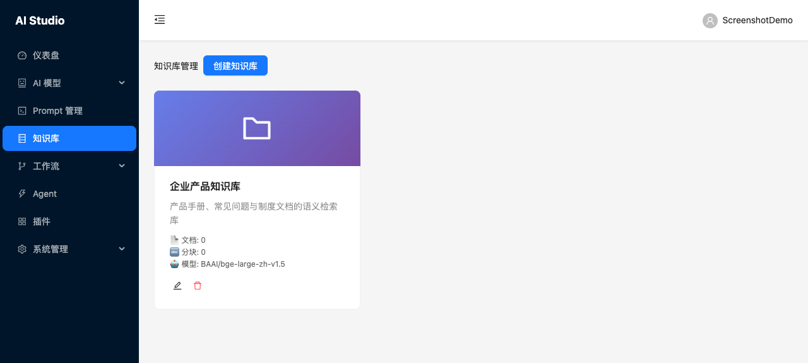
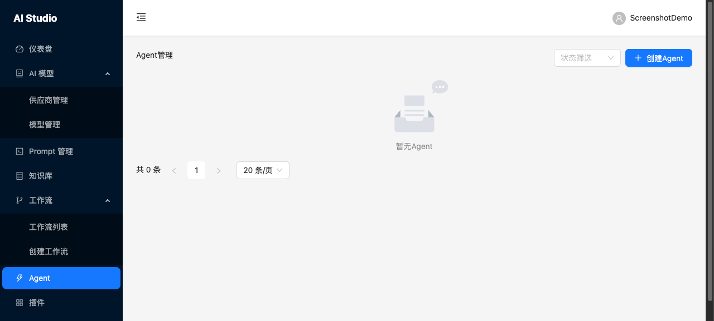

# AI-Studio

企业级 AI 应用平台 —— 在统一的工作台上接入多家大模型、沉淀企业知识、编排智能 Agent 与自动化工作流，并以多租户与细粒度权限保障企业级安全。



---

## 为什么选择 AI-Studio

企业在落地 AI 时通常面临四道门槛：模型供应商碎片化、知识散落在各处、缺少可编排的自动化能力、以及难以在满足安全合规的前提下规模化推广。

AI-Studio 把这些能力收敛到一个平台：

- **一处接入，多家模型**：统一管理 OpenAI、Anthropic、Azure、Ollama 等供应商，API Key 双层加密，业务侧无需关心底层差异。
- **知识即服务**：把文档变成可语义检索的知识库，让大模型回答"有据可依"。
- **从对话到自动化**：既支持即问即答的 Agent，也支持可视化编排的 DAG 工作流，覆盖从探索到生产的全过程。
- **天生企业级**：多租户数据隔离、细粒度 RBAC、全量审计与配额管控，开箱即用。

---

## 核心业务能力

| 能力 | 说明 | 业务价值 |
|------|------|----------|
| **多租户隔离** | 数据层按租户过滤，从根本防止跨租户数据泄漏 | 一套平台安全服务多个团队/客户 |
| **统一模型管理** | 集中接入多家 AI 供应商，API Key 加密存储，支持连通性测试 | 避免供应商锁定，统一治理成本与密钥 |
| **知识库（RAG）** | 文档上传 → 解析分块 → 向量化 → 语义检索 | 让回答基于企业私有知识，降低幻觉 |
| **智能 Agent** | ReAct 推理 + 工具绑定 + SSE 流式对话 + Markdown 渲染 | 像同事一样持续对话并调用工具完成任务 |
| **可视化工作流** | 拖拽式 DAG 编辑器（React Flow），LLM/条件/知识库/代码/工具/循环节点 | 把重复流程固化成可复用的自动化管线 |
| **插件生态** | 基于 OpenAPI 规范集成第三方 API | 用已有系统能力扩展 Agent 边界 |
| **监控审计与配额** | 全量审计日志、Token 用量统计、调用监控、资源配额 | 用量可控、行为可追溯、合规可证明 |

---

## 界面一览

### 统一模型接入

集中管理多家 AI 供应商，配置名称、类型、Base URL 与 API Key（加密存储），业务侧无需感知底层差异。



### 可视化工作流编辑器

基于 React Flow 的拖拽式 DAG 画布，提供开始/结束、LLM、条件、知识库、代码、工具、循环、变量等节点类型，支持保存、校验与发布。



### 知识库管理

卡片式管理企业知识库，展示文档数、分块数与所绑定的向量模型，一键进入文档管理与语义检索。



### Agent 管理

创建并管理智能 Agent，设置状态筛选、绑定工具与模型，进入流式对话界面。



---

## 典型应用场景

- **企业知识助手**：将制度、产品手册、FAQ 接入知识库，员工用自然语言即刻获取准确答案。
- **自动化业务工作流**：用 DAG 把"接收表单 → 调用模型生成 → 检索知识库核验 → 写入业务系统"串成一条自动化流水线。
- **内部 Agent 中台**：为不同部门快速搭建专属 Agent，统一在平台上管理模型、权限与配额。
- **合规审计场景**：借助多租户隔离与全量审计日志，满足金融、政企等对数据隔离与操作留痕的硬性要求。

---

## 快速体验

推荐使用 Docker Compose 一键拉起全部依赖与前后端服务（MySQL、Redis、Qdrant、后端 API、Celery Worker、前端 Nginx）：

```bash
cp .env.example .env      # 按需修改密码与密钥
docker compose up -d --build
```

启动后访问前端控制台 `http://localhost:80`，注册账号（自动初始化租户），在「AI 模型管理」中配置模型供应商与 API Key 即可开始使用。

> 完整的环境要求、本地开发启动、环境变量说明与运维命令，请查阅 [AGENTS.md](AGENTS.md)（技术架构与开发指南）。

---

## 了解更多

- **技术架构与开发指南**：[AGENTS.md](AGENTS.md)
- **编码约定（面向 AI 代理）**：[CLAUDE.md](CLAUDE.md)
- **设计文档**：[docs/](docs/)（系统架构、API 设计、数据库设计、核心机制、前端设计、实施计划）
- **在线 API 文档**：后端启动后访问 `http://localhost:8000/docs`（Swagger）与 `http://localhost:8000/redoc`（ReDoc）

---

## License

MIT
